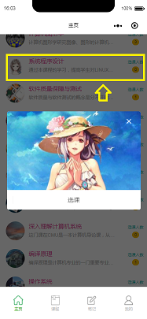
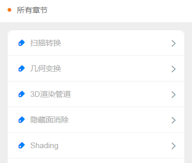
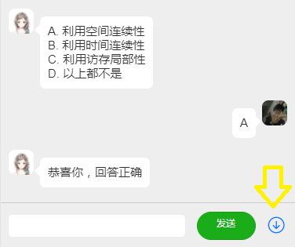
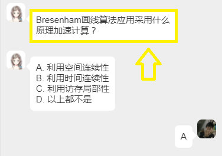
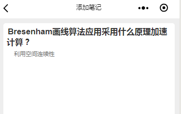
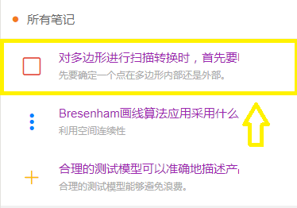
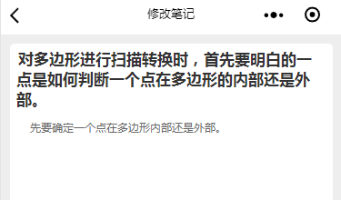
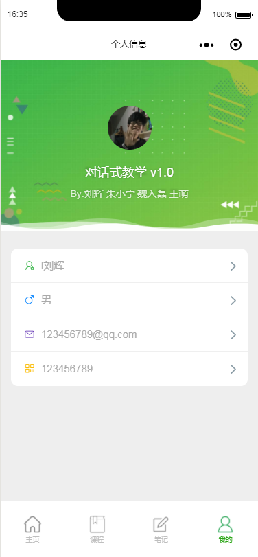

### 微信小程序的操作说明
#### 刘辉 16302010048
+ 对话式教学系统微信git库：https://github.com/XHHuiL/ConversationalEducation
+ 对话式教学系统微信后端git库：https://github.com/XHHuiL/ConversationalEducationServer
+ 点击底部导航栏的“主页”查看所有课程

+ 点击主页上的课程条目进行选课

+ 点击底部导航栏的“课程”查看已选课程

+ 点击已选课程的一个条目，查看此课程的所有章节
 

+ 进入一个章节学习，点击底部的向下按钮获取章节内容

+ 点击对话内容，对此内容添加笔记
 

+ 点击底部导航栏的“笔记”查看所有笔记

+ 点击所有笔记的一个条目，进入修改笔记、删除笔记页面
 

+ 点击底部导航栏的“我的”查看昵称、性别、邮箱等信息，可以对这些信息进行修改

